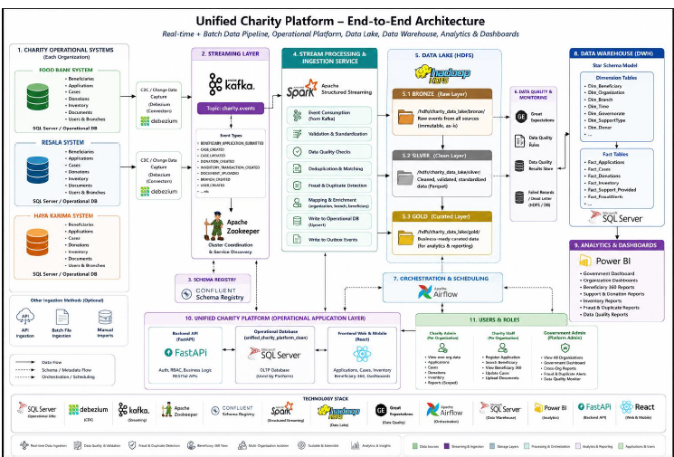

# Aoun — Unified Charity Data Engineering Platform

Aoun is an end-to-end **Data Engineering Capstone Project** designed to unify fragmented charity operations into a trusted analytical ecosystem.
The platform integrates data from multiple charity organizations and transforms operational records into governed, quality-checked, decision-ready analytics.

The project focuses on building a complete data pipeline from operational databases to a Data Lake, Data Warehouse, and Power BI dashboards to support transparency, fair aid distribution, duplicate-support detection, and strategic decision-making.

---

## Project Overview

Charity organizations often store their data separately across different systems. Beneficiary records, applications, cases, donations, inventory, and support history may exist in disconnected databases, making it difficult to:

* Build a unified view of beneficiaries.
* Detect duplicate support across organizations.
* Generate trusted analytical reports.
* Track historical trends and operational performance.
* Support government-level and charity-level decisions.

Aoun solves this by creating a unified data engineering workflow that standardizes data, preserves history, applies quality checks, and publishes trusted analytics.

---

## Architecture

The following architecture shows the full data flow from operational systems to analytics dashboards.



---

## End-to-End Data Pipeline

The project follows a complete data engineering lifecycle:

1. **Operational Sources**
   Data is generated and loaded into operational charity databases representing organizations such as Food Bank, Resala, and Haya Karima.

2. **Change Data Capture**
   CDC is enabled using Debezium to capture inserts, updates, and deletes from source databases.

3. **Streaming Layer**
   Kafka streams database changes as events, while Schema Registry helps maintain structured and consistent event formats.

4. **HDFS Data Lake**
   Data is stored across three layers:

   * **Bronze Layer:** Raw ingested data.
   * **Silver Layer:** Cleaned and standardized data.
   * **Gold Layer:** Business-ready analytical datasets.

5. **Spark Processing**
   Apache Spark processes the data across Bronze, Silver, and Gold layers, applying transformations, standardization, joins, and business rules.

6. **Data Quality Management**
   Automated checks validate completeness, duplicates, formats, referential integrity, and business rules before data is used for analytics.

7. **SQL Server Data Warehouse**
   Gold-layer data is loaded into a structured analytical warehouse using facts, dimensions, and analytics views.

8. **Power BI Dashboards**
   Power BI dashboards provide insights into beneficiaries, applications, cases, donations, inventory, risk alerts, and data quality.

---

## Key Features

* Unified charity data model.
* Beneficiary 360 analytical foundation.
* CDC-based streaming using Debezium and Kafka.
* Bronze, Silver, and Gold Data Lake architecture.
* Spark-based transformation pipelines.
* SQL Server analytical Data Warehouse.
* Automated Data Quality checks.
* Airflow orchestration for pipeline execution.
* Power BI dashboards for decision-making.
* Risk and duplicate-support visibility.
* Governance and observability outputs.

---

## Technology Stack

| Layer                | Technologies                 |
| -------------------- | ---------------------------- |
| Frontend             | React, Vite                  |
| Backend              | FastAPI                      |
| Operational Database | SQL Server                   |
| CDC                  | Debezium                     |
| Streaming            | Apache Kafka                 |
| Schema Management    | Schema Registry              |
| Processing           | Apache Spark                 |
| Data Lake            | HDFS                         |
| Orchestration        | Apache Airflow               |
| Data Warehouse       | SQL Server                   |
| Analytics            | Power BI                     |
| Infrastructure       | Docker, Docker Compose       |
| Data Quality         | Automated validation scripts |

---

## Data Modeling Approach

Aoun uses a **Hybrid Dimensional Modeling** approach with a star-like / fact constellation structure.

### Core Fact Tables

* Applications
* Cases
* Donations
* Inventory Transactions
* Risk Alerts
* Data Quality Results

### Shared Dimensions

* Beneficiary
* Donor
* Organization
* Time
* Branch
* Governorate
* Support Type
* Item

This modeling approach supports multiple analytical use cases while avoiding duplicated logic across dashboards.

---

## Data Quality Results

The pipeline includes automated quality checks to ensure that analytics are reliable before being published.

Project validation results:

* **116 total Data Quality checks**
* **116 passed checks**
* **0 failed checks**
* **0 warning checks**

These checks help validate completeness, consistency, duplicates, formats, referential integrity, and business rules.

---

## Dashboard KPIs

The Power BI dashboards include high-level indicators such as:

* Beneficiaries
* Donors
* Applications
* Cases
* Donations
* Donation Value
* Requested Amount
* Inventory Value
* Risk Indicators
* Data Quality Status

---

## Project Structure

```text
aoun-data-engineering-platform/
│
├── backend/                     # FastAPI backend services
├── frontend/                    # React frontend application
├── database_setup/              # SQL Server setup scripts
├── data_engineering/            # DE pipeline scripts and jobs
├── infra/                       # Docker Compose infrastructure
├── DWH_Scripts_For_Analyst/     # Data Warehouse loading and validation scripts
├── docs/                        # Project documentation and architecture images
├── README.md                    # Project documentation
└── .gitignore                   # Ignored local/generated files
```

---

## How to Run Locally

> This project requires Docker services such as SQL Server, Kafka, Debezium, HDFS, Spark, Airflow, and Schema Registry.

### 1. Clone the Repository

```bash
git clone https://github.com/emaabdelnaby3-rgb/aoun-data-engineering-platform.git
cd aoun-data-engineering-platform
```

### 2. Configure Environment Variables

Create your local environment file based on the example file:

```bash
cp backend/.env.example backend/.env
```

Update the values in `.env` according to your local setup.

> Real credentials are not included in this public repository. Use your own local passwords and secrets.

### 3. Start Infrastructure

Use Docker Compose files inside the `infra/` directory to start the required services.

```bash
docker compose -f infra/docker-compose.presentation.yml up -d
```

### 4. Run Backend

```bash
cd backend
pip install -r requirements.txt
uvicorn app.main:app --reload
```

### 5. Run Frontend

```bash
cd frontend
npm install
npm run dev
```

### 6. Run Data Engineering Pipeline

The data engineering scripts are organized under the `data_engineering/` directory and cover the workflow from DE-1 to DE-17, including ingestion, CDC, streaming, processing, quality validation, warehouse loading, orchestration, and analytics.

---

## Security Notice

This is a public academic repository.
Sensitive local files such as `.env`, database files, logs, generated outputs, and large Power BI files are excluded using `.gitignore`.

All public configuration files use placeholder credentials such as:

```text
ChangeMe_StrongPassword_2026!
```

Users should replace these placeholders with secure local values before running the project.

---

## Project Impact

Aoun is more than a dashboard or a web platform. It is a trusted data foundation for charity and social-support decision-making.

By unifying fragmented charity data, the project supports:

* Fairer aid distribution.
* Better visibility across organizations.
* Reduced duplicate support.
* Faster and more reliable reporting.
* Stronger governance and transparency.
* Future national-level charity data integration.

---

## Team

This project was developed as part of the Artificial Intelligence / Data Engineering Capstone Track.

Team members:

* Eman Abdelnaby
* Sara Abdelraheem
* Alzahraa Sawy
* Fatma Khaled

Supervised by:

* Dr. Rania ElGohary
* Dr. Mohamed El Badawi
* Eng. Engy Ayman
* Eng. Sama

---

## Conclusion

Aoun demonstrates how trusted, governed, and connected data can transform charity operations into decision-ready intelligence.

When charity data becomes unified and quality-checked, it becomes more than operational records.
It becomes a strategic asset for transparency, social impact, and better decision-making.
